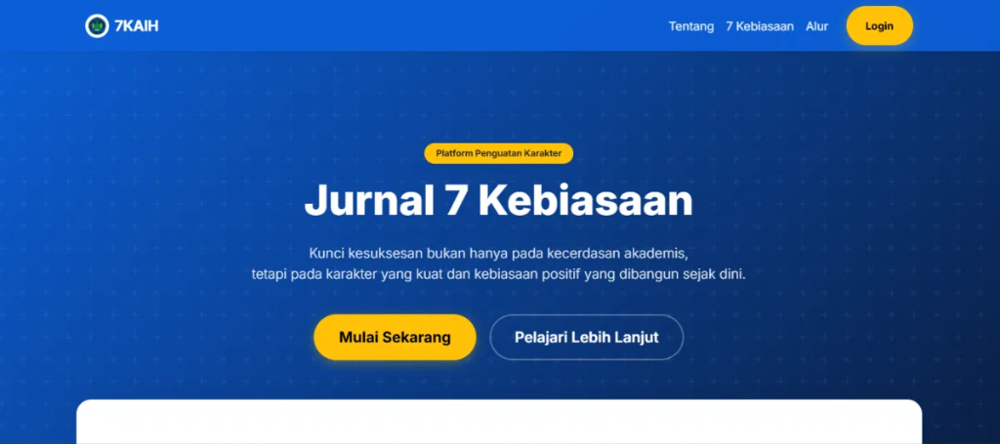

<p align="center">
  
</p>

# Jurnal 7KAIH (7 Kebiasaan Anak Indonesia Hebat)

**Sistem Jurnal & Monitoring Sekolah Berbasis Web (Laravel 12)**

Jurnal 7KAIH adalah aplikasi modern yang dirancang untuk membantu sekolah dalam memonitoring penerapan "7 Kebiasaan Anak Indonesia Hebat". Aplikasi ini mengintegrasikan peran Guru, Siswa, dan Orang Tua dalam satu ekosistem digital yang transparan dan *real-time*.

## 🌟 Fitur Unggulan

*   **Multi-Role System**: Hak akses spesifik untuk Admin, Guru, Siswa, dan Wali Murid.
*   **Jurnal Harian & Habit Tracker**: Monitoring kebiasaan siswa (ibadah, sosial, literasi) dengan statistik visual.
*   **Laporan Otomatis**: Generate laporan perkembangan karakter siswa format PDF secara otomatis.
*   **Pantauan Orang Tua**: Wali murid dapat melihat aktivitas dan jurnal anak langsung dari dashboard mereka.
*   **UI/UX Modern**: Tampilan antarmuka yang bersih dan responsif menggunakan **Tailwind CSS**.

## 🚀 Teknologi

Aplikasi ini dibangun menggunakan teknologi web terbaru untuk menjamin performa dan keamanan:

*   **Backend**: Laravel 12 (PHP Framework)
*   **Frontend**: Tailwind CSS, Blade Templates
*   **Database**: MySQL
*   **Asset Bundling**: Vite

## 📦 Instalasi (Untuk Developer)

1.  Clone repository ini:
    ```bash
    git clone https://github.com/OzanProject/Jurnal7KAIH.git
    ```
2.  Install dependensi PHP & Node.js:
    ```bash
    composer install
    npm install
    ```
3.  Setup Environment:
    ```bash
    cp .env.example .env
    php artisan key:generate
    ```
4.  Jalankan Migrasi & Seeder:
    ```bash
    php artisan migrate --seed
    ```
5.  Jalankan Server:
    ```bash
    npm run dev
    php artisan serve
    ```

## 🤝 Dukungan & Donasi

Jika aplikasi ini bermanfaat bagi sekolah atau pembelajaran Anda, dukungan Anda sangat berarti untuk pengembangan fitur selanjutnya!

[**👉 Baca Artikel Selengkapnya & Dukung Pengembang**](https://ozanproject.site/article/aplikasi-jurnal-7kaih-7-kebiasaan-anak-indonesia-hebat-source-code-laravel-12-terbaru-2026)

---

<p align="center">
  Dibuat dengan ❤️ untuk Pendidikan Indonesia
</p>
